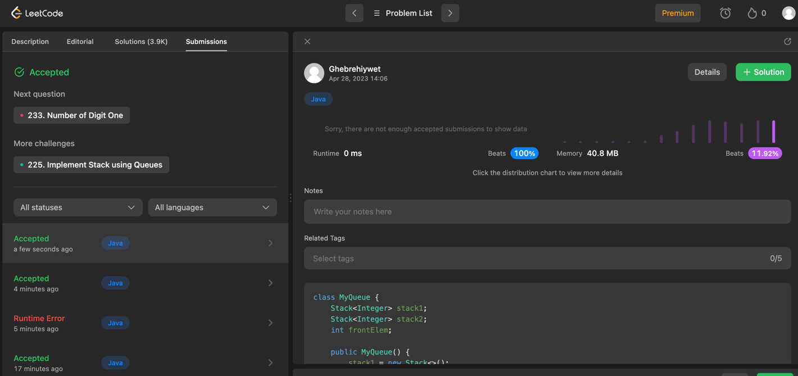
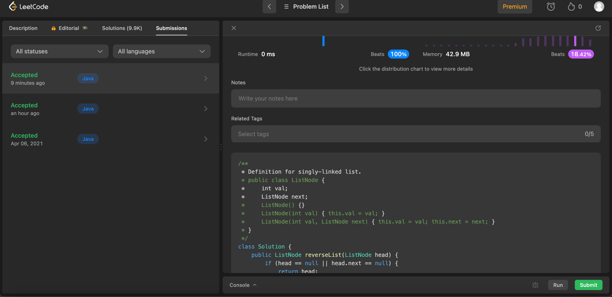
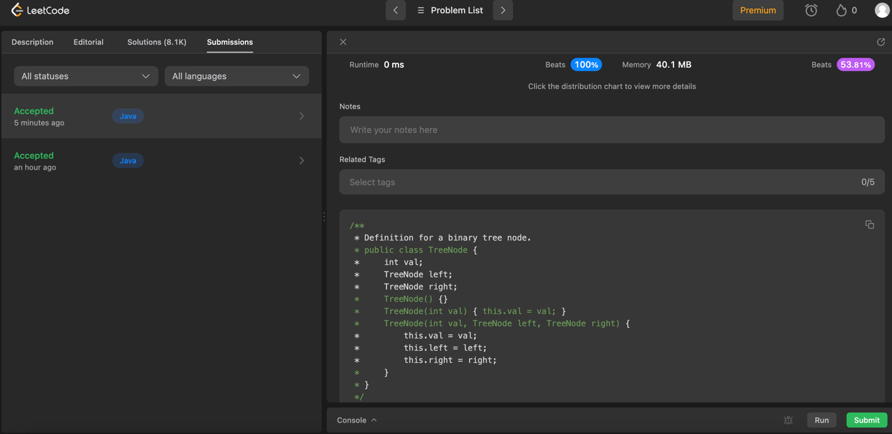
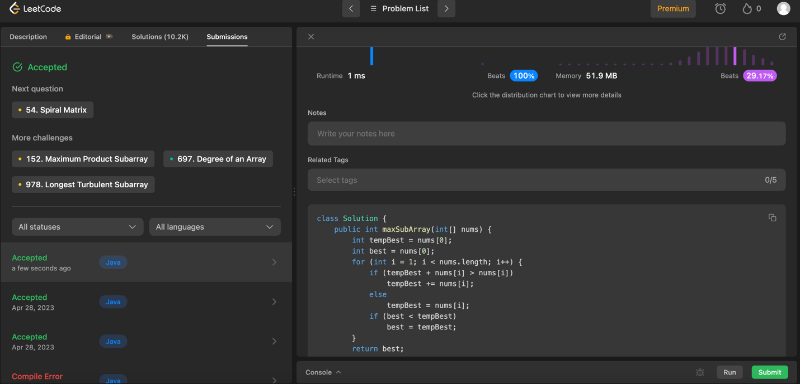

# DSA_Practices

1. **Implement Queue using Stacks - LeetCode**
https://leetcode.com/problems/implement-queue-using-stacks/description/

Solution:  src/main/com/github/gridu/dsa/QueueUsingStacks.java

2. **Reverse Linked List - LeetCode**
https://leetcode.com/problems/reverse-linked-list/description/

Solution: src/main/com/github/gridu/dsa/ReverseLinkedList.java

3. **Same Tree - LeetCode**
https://leetcode.com/problems/same-tree/description/

Solution: src/main/com/github/gridu/dsa/SameTree.java

4. **Maximum Subarray - LeetCode**
https://leetcode.com/problems/maximum-subarray/description/

Solution: src/main/com/github/gridu/dsa/MaximumSubarray.java

5. **Two Sum - LeetCode**
https://leetcode.com/problems/two-sum/description/

Solution: src/main/com/github/gridu/dsa/TwoSum.java

